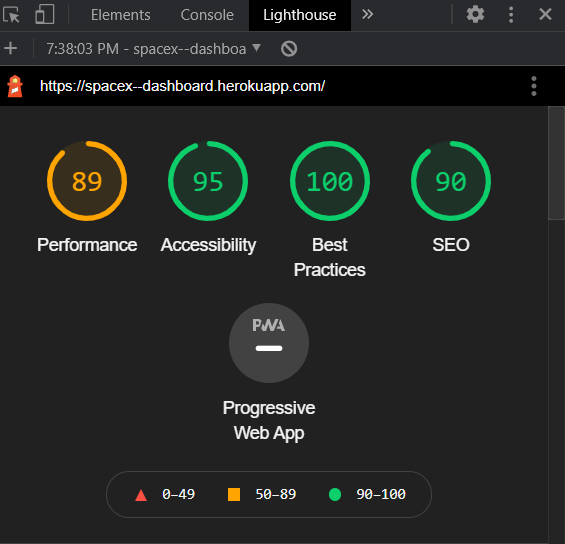

# SpaceX-Dashboard
## Access deployed URL here
https://spacex--dashboard.herokuapp.com/

## Getting Started

First, install dependencies and then start server

```bash
npm run install
# then

npm run dev
# or
yarn dev
```

Open [http://localhost:3000](http://localhost:3000) with your browser to see the result.

---

## Approach

1. I've gone through the requirements and listed down all the scenarios and action items that needs to be handled.
2. Picked up NextJs as boilerplate to implement server side rendering of App, gone through all the required docs.
3. Implemented static HTML/CSS website first to mimic the comps
4. Started building application by setting up NextJs, then heroku deployement and Travis-CI pipeline.
5. Based on the drafted approach started breaking up the application into components.
6. Set Testing framework for components and added script to pipeline.
7. After implementing all stateless components and converting prototype to developed code. I started building the logic to handle events and URL changes.

---

## Stack

- NextJs - ReactJs [Base setup]
- Jest -Enzyme [Test Setup]
- Travis-CI [Pipeline Setup]
- Heroku [deployments]

---

## Lighthouse Report

